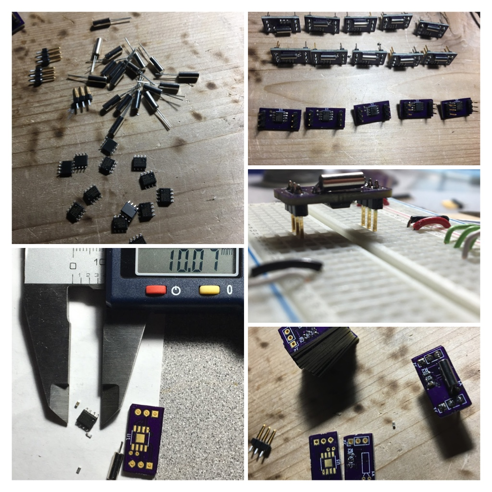

A breakout module for a DS1307 Real Time Clock

# Why
Why would you build a module, that costs you more, than existing breakout modules you can readily buy, that do more things?  Well. to learn of course.
I also had some parts in stock from AliExpress. Felt kind of silly to go order some break out boards when I could just build me some.

I wanted a smaller footprint size than the modules that existed, working at the time to build a tiny clock for the kids. I ended up using the adafruit breakout because i had it already, but for next time I wanted to be smaller.  To do this I just didn't put the battery holder on the board, a pin to hook it up. So we have to provide our own battery. And I used components on both sides of the board.  I don't really like the not-surface mount crystal oscillator, but again just using up some stock I happened to have here.

Schematics done using Kicad

# Software
Just using one of the existing DS1307 libraries for your platform should work. I don't really have my own library for this yet, I use the Adafruit one for Arduino.